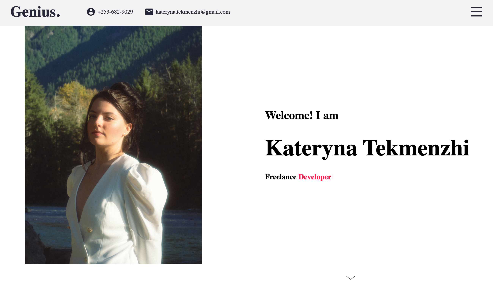

# React Portfolio

## Description
This application showcases a professional portfolio for Kateryna Tekmenzhi. 

## Table of Contents
* [Usage](#usage)
* [Technologies](#technologies)
* [Questions](#questions)
* [License](#license)
## Usage
Navigate to the [deployed](https://katerynatekmenzhi.github.io/new-react-portfolio/)

The following image shows the application's homepage.

## Technologies

## License

---
### Questions

Deployment link is 
[here](https://katerynatekmenzhi.github.io/new-react-portfolio/)

Repositary link is 
[here](https://github.com/KaterynaTekmenzhi/new-react-portfolio)

Kateryna.koltunova@gmail.com
[KaterynaTekmenzhi](https://github.com/KaterynaTekmenzhi)
